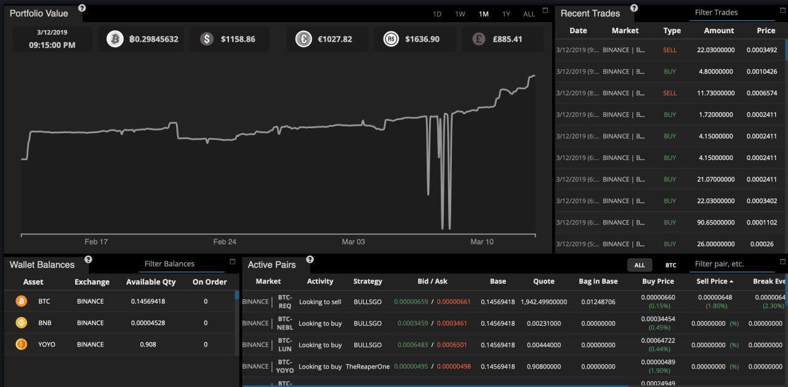

# Добро пожаловать в Gunbot wiki

**Gunbot - это простой в использовании, продвинутый бот для крипто-трейдинга. Вы выбираете свою торговую стратегию и следите за тем, как Gunbot ведет торговлю за вас. Бот позволит вам проводить до сотни прибыльных сделок в день, в режиме 24/7.**

Из соображений безопасности Gunbot работает только на вашем локальном компьютере или на вашем сервере. Таким образом, секрет вашего торгового API остается закрытым, и никто не может влиять или контролировать вашу торговлю.

Единовременная плата дает вам пожизненную поддержку и обновления программного обеспечения.

> _Наша цель - создать идеальную денежную машину_

### Gunbot используется тысячами пользователей и имеет уникальное сообщество пользователей ❤️









### Ссылки на описание стратегий

| Стратегия | Обычная торговля | Маржинальная торговля |
| :--- | :--- | :--- |
| `ADX` | [Regular](trading-strategy-options/regular-strategies-spot-trading/adx.md) | [Margin](trading-strategy-options/margin-trading-strategies/adx.md) |
| `ATRTS` | [Regular](trading-strategy-options/regular-strategies-spot-trading/atrts.md) | [Margin](trading-strategy-options/margin-trading-strategies/atrts.md) |
| `bb` | [Regular](trading-strategy-options/regular-strategies-spot-trading/bollinger-bands.md) | [Margin](trading-strategy-options/margin-trading-strategies/bollinger-bands.md) |
| `BBTA` | [Regular](trading-strategy-options/regular-strategies-spot-trading/bollinger-bands-ta.md) | [Margin](trading-strategy-options/margin-trading-strategies/bollinger-bands-ta.md) |
| `EMASPREAD` | [Regular](trading-strategy-options/regular-strategies-spot-trading/ema-spread.md) | [Margin](trading-strategy-options/margin-trading-strategies/ema-spread.md) |
| `emotionless` | [Regular](trading-strategy-options/regular-strategies-spot-trading/emotionless.md) | N/A |
| `gain` | [Regular](trading-strategy-options/regular-strategies-spot-trading/gain.md) | [Margin](trading-strategy-options/margin-trading-strategies/gain.md) |
| `ichimoku` | [Regular](trading-strategy-options/regular-strategies-spot-trading/ichimoku.md) | [Margin](trading-strategy-options/margin-trading-strategies/ichimoku.md) |
| `MACD` | [Regular](trading-strategy-options/regular-strategies-spot-trading/macd.md) | [Margin](trading-strategy-options/margin-trading-strategies/macd.md) |
| `MACDH` | [Regular](trading-strategy-options/regular-strategies-spot-trading/macdh.md) | [Margin](trading-strategy-options/margin-trading-strategies/macdh.md) |
| `pp` | [Regular](trading-strategy-options/regular-strategies-spot-trading/pingpong.md) | [Margin](trading-strategy-options/margin-trading-strategies/pingpong.md) |
| `stepgain` | [Regular](trading-strategy-options/regular-strategies-spot-trading/stepgain.md) | [Margin](trading-strategy-options/margin-trading-strategies/stepgain.md) |
| `SMACROSS` | [Regular](trading-strategy-options/regular-strategies-spot-trading/sma-cross.md) | [Margin](trading-strategy-options/margin-trading-strategies/sma-cross.md) |
| `tsa` | [Regular](trading-strategy-options/regular-strategies-spot-trading/time-series-analysis.md) | [Margin](trading-strategy-options/margin-trading-strategies/time-series-analysis.md) |
| `tssl` | [Regular](trading-strategy-options/regular-strategies-spot-trading/tssl-trailing-stop-stop-limit.md) | [Margin](trading-strategy-options/margin-trading-strategies/tssl-trailing-stop-stop-limit.md) |


## Disclaimer

The information provided on this wiki does not constitute investment advice, financial advice, trading advice, or any other sort of advice, and you should not treat any of the wiki's content as such. Gunbot does not recommend that any asset should be bought, sold, or held by you. Nothing on this website should be taken as an offer to buy, sell or hold a cryptocurrency.

Do conduct your own due diligence and consult your financial advisory before making any investment decision. Gunbot will not be held responsible for the investment decisions you make based on the information published on this wiki.


**Project origin:** [BitcoinTalk thread](https://bitcointalk.org/index.php?topic=1715214.0).

