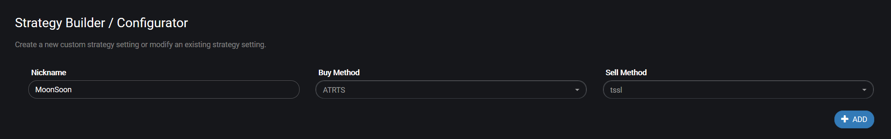

# IMAP listener


The IMAP listener settings are only needed when you use the TradingView add-on to let Gunbot execute email alerts.


Using these settings, Gunbot connects to the email address where alerts are sent to.

To change them, go to **Settings** &gt; **IMAP Listener**.

## Settings descriptions

Below you'll find detailed descriptions of all available parameters for the IMAP listener.

### Enabled



Set this to true to enable the TradingView plugin. Not all license types support this option.



**Values:** true or false

**Default value:** false



Parameter name in `config.js`: `enabled`



### Authorized froms



Sets the email addresses that should be processed for incoming alerts. Make sure that the alert message in contained in the email subject.

Multiple address are possible if you enter them like this: \["email-1@mail.com","email-2@mail.com"\]



**Values:** string, represents one or more email addresses

**Default value:** \["noreply@tradingview.com"\]



Parameter name in `config.js`: `authorized_froms`



### User



Set the username for the IMAP server, usually your own email address. Gunbot will listen for incoming alerts on this address.



**Values:** string, represents a username

**Default value:** YOUREMAIL



Parameter name in `config.js`: `user`



### Password



Enter the password for your own email address, used for connecting to the IMAP server.



**Values:** string, represents a password

**Default value:** YOURPASSWORD



Parameter name in `config.js`: `password`



### Host



The address of the IMAP server that the listener needs to connect to.



**Values:** string, represents a hostname

**Default value:** imap.gmail.com



Parameter name in `config.js`: `host`



### Port



The port number for the IMAP server.



**Values:** number, represents a port number

**Default value:** 993



Parameter name in `config.js`: `port`



### TLS



Defines if TLS encryption is used for the IMAP connection.



**Values:** true or false

**Default value:** true



Parameter name in `config.js`: `tls`



