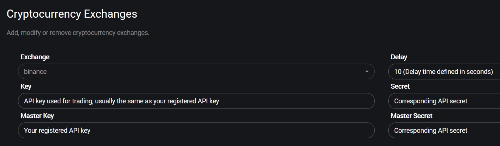

# Monitoring

Monitoring and evaluating your trades is an important aspect of bot trading. Gunbot makes it easy to visualize the trades it makes, this will help you to keep improving your trading strategies.

## Charts

The built in charts exclusively use data available to the Gunbot Core. You can let it draw every indicator that Gunbot offers. Trades are visualized on the chart.

Charts go as far back as the exchange API returns candles to your bot.

## Dashboard

Monitor your portfolio value on the dashboard, it shows the combined value of active BTC, USD\(T\) and EUR trading pairs.

The pair overview quickly shows you which of your trading pairs are doing good.

## Trading map

The trading map gives you instant information about how your pairs are doing.

