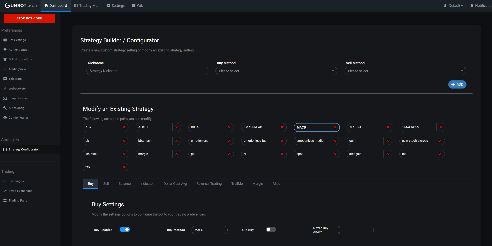

# Authentication

## Password

The first time you visit the Gunbot GUI in your browser, you'll be asked to register your password.

## Two factor authentication \(2FA\)

Gunbot supports two factor authentication, using Google Authenticator, Authy or similar apps.

To enable 2FA, go to **Settings** &gt; **Authentication**.

