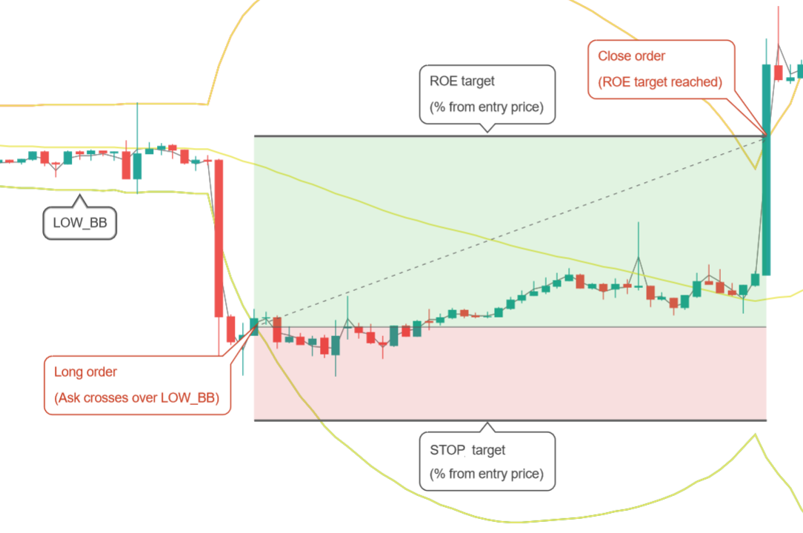

# Websockets

Gunbot emits certain data through websockets. Limited documentation for this feature is available on the following repository: [https://github.com/GuntharDeNiro/Gunthy/\#webgui-informations-for-devs-](https://github.com/GuntharDeNiro/Gunthy/#webgui-informations-for-devs-)

To change websocket settings, go to **Settings** &gt; **Websocket**.

## Settings descriptions

Below you'll find detailed descriptions of all available parameters for websockets.

### Port



Sets the port used for websockets.



**Values:** numerical, represents a port number

**Default value:** 5001



Parameter name in `config.js`: `port`



### Client Port



You can change the client port for third party web interfaces here.



**Values:** numerical, represents a port number.

**Default value:** 3000



Parameter name in `config.js`: `clientport`



### Hostname



The IP address or hostname to be used for WebSockets. Defaults to your localhost. An external IP can also be set.



**Values:** string, represents an IP-address or hostname

**Default value:** 127.0.0.1



Parameter name in `config.js`: `hostname`



