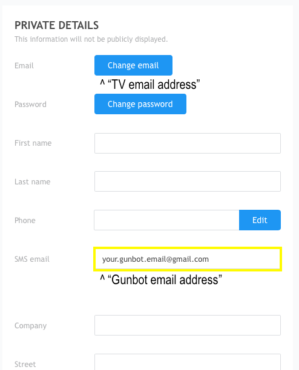

# Telegram notifications

Gunbot can send notifications on Telegram for every trade it places.

To set this up, go to **Settings** &gt; **Telegram**.

## Steps to create a Telegram bot

Notifications work by first creating a personal bot on Telegram, Gunbot then connects to this bot to push notifications to you.

This is how to create a bot:

1. Talk to [@botfather](https://telegram.me/botfather). Create a new bot with the command /newbot and choose a name and username for your bot. Save the bot token shown
2. Talk to [@myidbot](https://telegram.me/myidbot) to see your Chat ID, save it.
3. Enable Telegram notifications for Gunbot, and enter the token and ID you've just gathered.
4. Start a chat with the username you've picked for your bot, and hit the start button. If you don't see a start button, write "/start" and click on it afterwards.

## Settings descriptions

Below you'll find detailed descriptions of all available parameters for Telegram notifications.

### Enabled



Enable this to have Gunbot send trade notifications through Telegram.



**Values:** true or false

**Default value:** false



Parameter name in `config.js`: `TELEGRAM_ENABLED`



### Bot Nickname



Each trade notification starts with the nickname set here.

Use this to easily check from which bot instance the notifications have been sent.



**Values:** string

**Default value:** Gunbot



Parameter name in `config.js`: `TELEGRAM_NICK`



### Token



The Telegram token for your bot.



**Values:** string

**Default value:** YOURTOKEN



Parameter name in `config.js`: `TOKEN`



### Chat ID



The Chat ID for your bot to send its messages to.

**Valid options:**

_**"12345"**_

A positive integer, to send messages directly to a telegram user. Use this method when you just want to receive notifications for your personal use.

To find your telegram id, send /start to @MyTelegramID\_bot and it will respond with your ID.

_**"-12345"**_

A negative integer, to send messages to a group chat.

The easiest way to obtain a groups id, is to open [https://web.telegram.org](https://web.telegram.org) login, and navigate to the group. Now pay attention to the URL, you should see something like [https://web.telegram.org/\#/im?p=g12345](https://web.telegram.org/#/im?p=g12345) - the number after the p=g part is the group id.

This must be listed in chat\_id with a - symbol in front, in this case "-12345"



**Values:** string

**Default value:** 123456789



Parameter name in `config.js`: `chat_id`



### TG PL Only



When enabled notifications will be only sent for strategy sell orders.



**Values:** true or false

**Default value:** false



Parameter name in `config.js`: `TG_PL_ONLY`



### Telegram Order Timeout



When set above 0, you'll receive a Telegram dialog to manually allow or deny every order Gunbot wants to place.

During the set amount of seconds you can choose to allow the order \(and it will immediately be placed\) or deny it. After the timeout passes without reply, the order will be placed at the exchange.



**Values:** numerical, represent time in seconds.

**Default value:** 0



Parameter name in `config.js`: `TG_PL_ONLY`



### TG Test



Enable this to test if your Telegram bot is working.

A test message will be sent on the first round for each pair. Disable after verifying your bot works.



**Values:** true or false

**Default value:** false



Parameter name in `config.js`: `TG_TEST`



